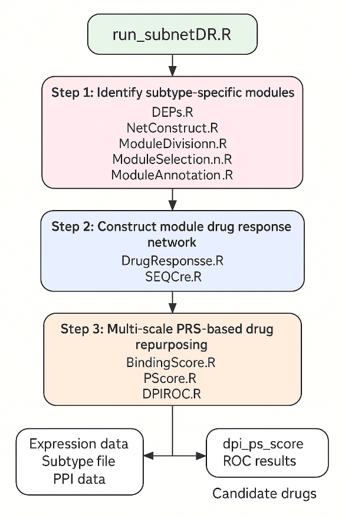

# subnetDR

subnetDR is an R/Python workflow for subtype-specific network module identification and drug repositioning. It integrates proteomics data, protein-protein interaction networks, drug response prediction, drug-target interaction prediction, and perturbation-response scoring to prioritize candidate drugs for cancer subtypes.

<p align="center">
  
</p>

## Software Copyright

**A Subtype-Specific Network Module Identification and Drug Repositioning System Software V1.0**  
Software Copyright, Registration No. **2025SR142352**, 2025.

## Overview

Cancer heterogeneity can lead to distinct molecular subtypes with different treatment responses and clinical outcomes. subnetDR is designed to identify subtype-specific protein network modules and prioritize candidate drugs by combining:

- Proteomics-based subtype analysis
- Differential protein expression analysis
- Protein-protein interaction network construction
- Network module detection and functional annotation
- Drug response prediction
- Drug-target interaction prediction
- Elastic network model-based perturbation response analysis
- Drug repositioning score calculation and ROC evaluation

The complete workflow can be run through `run_subnetDR_pipeline()` or executed step by step.

## Workflow

The subnetDR pipeline contains three major stages.

### 1. Subtype-Specific Module Identification

Scripts:

- `DEPs.R`
- `NetConstruct.R`
- `ModuleDivision.R`
- `ModuleSelection.R`
- `ModuleAnnotation.R`

Main tasks:

- Identify differentially expressed proteins across subtypes
- Construct subtype-specific PPI networks using String, PhysicalPPIN, and ChengF networks
- Detect network modules using Louvain or ne-PCA/WF-based module division
- Select modules based on minimum node number
- Perform GO, KEGG pathway, and Hallmark enrichment analyses

### 2. Drug Response Network Construction

Scripts:

- `DrugResponse.R`
- `SEQCre.R`

Main tasks:

- Predict drug response using `oncoPredict`
- Cluster samples based on module-specific expression profiles
- Construct drug response networks
- Extract protein FASTA sequences and drug SMILES files for downstream drug-target prediction

### 3. PRS-Based Drug Repositioning

Scripts:

- `BindingScore.R`
- `PScore.R`
- `DPIROC.R`

Main tasks:

- Predict drug-target binding affinity using DeepPurpose
- Compute perturbation response matrices using elastic network model-based analysis
- Integrate binding affinity and perturbation sensitivity into a PS score
- Rank candidate drug-target pairs
- Evaluate predictions using known drug-target interactions from TTD and DrugBank

## System Requirements

The software was tested under:

- OS: Windows 10 64-bit
- CPU: Intel Core i5-7500 @ 3.40 GHz
- Memory: 32 GB RAM
- R: 4.1.1
- Python: 3.10.14

Python-related steps require a Conda environment. The example environment below uses Python 3.9 and is compatible with the package workflow described in the software manual.

## Installation

### Install R Package

```r
install.packages("devtools")
library(devtools)
install_github("LilyYNY/subnetDR")
library(subnetDR)
```

### Create Python Environment
Open Anaconda Prompt or a terminal with Conda enabled.
```r
conda create -n py3.9 python=3.9
conda activate py3.9
pip install rdkit
pip install descriptastorus
pip install DeepPurpose
pip install seaborn
pip install goatools
pip install prody
```
If rdkit cannot be installed through pip, install it through Conda: conda install -c conda-forge rdkit
In R, the Python environment can be selected through reticulate or passed to subnetDR functions through the py_env argument.

### Required Input Files
For the automated workflow, place all required files under one project folder, for example F:/sample_test.
```r
expression.xlsx
subtype.xlsx
GDSC2_Expr.RData
GDSC2_Res.RData
DTI_DrugBank.RData
DTI_TTD.RData
```

### Required PPI directory:
```r
PPI/
├── String/
│   ├── 9606.protein.info.v11.5_new.txt
│   └── 9606.protein.info.v11.5.txt
├── PhysicalPPIN/
│   └── physicalppi
└── ChengF/
    ├── 9606.protein.info.v11.5_new.txt
    ├── Homo_sapiens_gene_info
    └── Human Interactome
```

### Required ENM directory:
```r
python/
└── enm/
```

### The input phenotype file subtype.xlsx should contain at least:
```r
Sample
Subtype
```
The expression matrix expression.xlsx should contain genes or proteins in the first column and samples in the remaining columns.

###  Quick Start
```r
library(devtools)
install_github("LilyYNY/subnetDR")
library(subnetDR)

base_path <- "F:/sample_test"
py_env <- "C:/Users/YangMiao/.conda/envs/py3.9"

run_subnetDR_pipeline(
  base_path = base_path,
  py_env = py_env
)
```

The pipeline runs the full workflow from differential expression analysis to network construction, module detection, functional annotation, drug response prediction, binding affinity prediction, perturbation-response scoring, and ROC evaluation.

### Notes
Please prepare PPI databases, GDSC drug response data, DrugBank/TTD drug-target data, and ENM files before running the full pipeline.
See the example sample_test workflow for expected file organization.
The package can be run as a full automated pipeline or step by step for debugging and customization.

